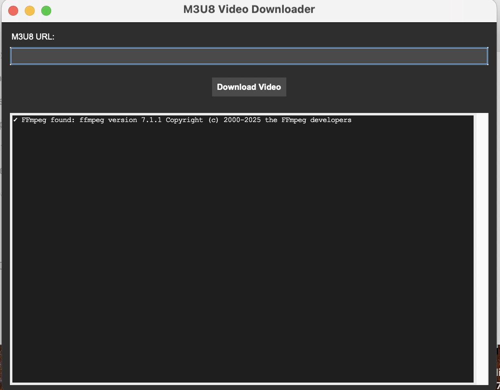
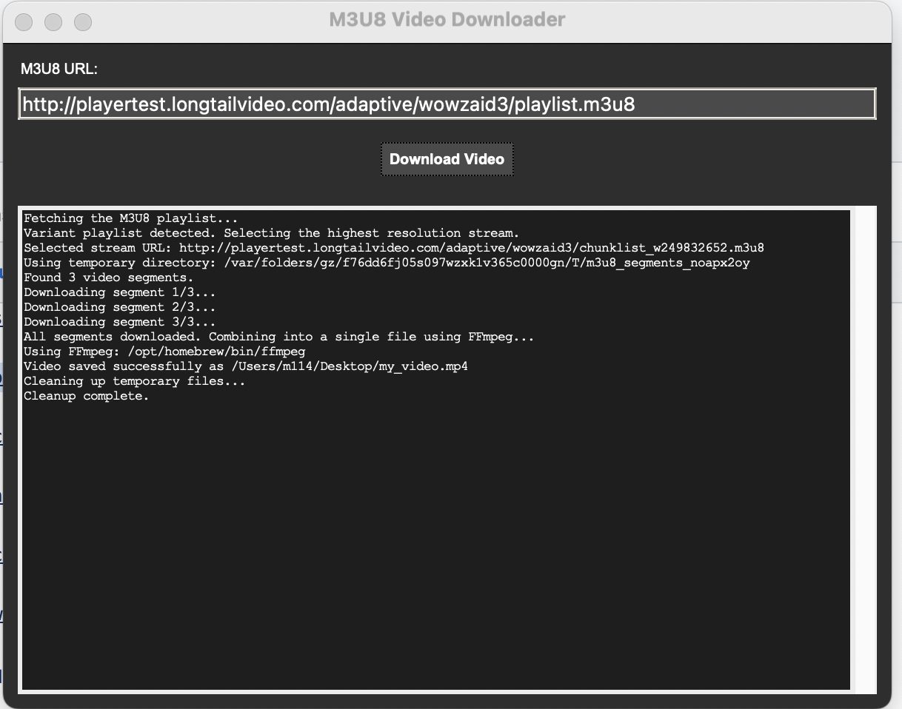

# 🎬 M3U8 Video Downloader

A powerful, cross-platform desktop application for downloading video streams from M3U8/HLS playlists. Built with Python and Tkinter, featuring a modern dark theme and robust error handling.


## ✨ Features

- 🎯 **Smart Playlist Detection**: Automatically handles both master and media playlists
- 🏆 **Quality Selection**: Automatically selects the highest available resolution
- 🎨 **Modern GUI**: Clean, dark-themed interface with real-time progress updates
- 🔄 **Robust Downloads**: Advanced retry logic and error recovery
- 🌐 **Cross-Platform**: Native support for Windows, macOS, and Linux
- ⚡ **FFmpeg Integration**: Seamless video segment concatenation
- 🛡️ **Error Handling**: Comprehensive error reporting with helpful solutions
- 📁 **Smart File Management**: Automatic temporary file cleanup

## 🖼️ Screenshots

### Main Interface


### Download Progress


## 🚀 Quick Start

### Download Pre-built Executables

#### Windows
1. Go to [Releases](../../releases/latest)
2. Download `M3U8Downloader-Windows.exe`
3. **⚠️ Antivirus Notice**: See [Antivirus Information](#-antivirus-information) below

#### macOS
1. Go to [Releases](../../releases/latest)
2. Download `M3U8Downloader-macOS.dmg`
3. Install and run the application

### Run from Source

```bash
# Clone the repository
git clone https://github.com/yourusername/m3u8-downloader.git
cd m3u8-downloader

# Install dependencies
pip install -r requirements.txt

# Run the application
python app.py
```

## 📋 Requirements

### System Requirements
- **Python**: 3.8 or higher (for source installation)
- **FFmpeg**: Required for video processing
- **OS**: Windows 10+, macOS 10.14+, or Linux

### Installing FFmpeg

#### Windows
```bash
# Using Chocolatey
choco install ffmpeg

# Or download from https://ffmpeg.org/download.html
```

#### macOS
```bash
# Using Homebrew
brew install ffmpeg
```

#### Linux (Ubuntu/Debian)
```bash
sudo apt update
sudo apt install ffmpeg
```

## 🎯 Usage

### GUI Application
1. **Launch** the application
2. **Paste** your M3U8 URL into the input field
3. **Click** "Download Video" 
4. **Choose** where to save your video file
5. **Wait** for the download to complete

### Supported URL Formats
- Direct M3U8 playlist URLs
- HLS stream URLs from various platforms
- Both master playlists (multiple qualities) and media playlists

### Example URLs
```
https://example.com/playlist.m3u8
https://stream.example.com/hls/video/playlist.m3u8
```

## 🛠️ Development

### Project Structure
```
m3u8-downloader/
├── app.py                    # Main GUI application
├── m3u8vi.py                 # CLI reference implementation
├── build.py                  # PyInstaller build script
├── requirements.txt          # Python dependencies
├── version_info.txt          # Windows version information
├── app_icon.ico/.icns        # Application icons
├── .github/workflows/        # CI/CD workflows
└── README.md                 # This file
```

### Building from Source

#### Install Build Dependencies
```bash
pip install -r requirements.txt
pip install pyinstaller
```

#### Build for Your Platform
```bash
python build.py
```

The executable will be created in the `dist/` folder.

### Development Setup
```bash
# Clone and enter directory
git clone https://github.com/yourusername/m3u8-downloader.git
cd m3u8-downloader

# Create virtual environment (recommended)
python -m venv venv
source venv/bin/activate  # On Windows: venv\Scripts\activate

# Install dependencies
pip install -r requirements.txt

# Run in development mode
python app.py
```

## ⚠️ Antivirus Information

**Windows users may encounter antivirus false positives.** This is common with PyInstaller executables and **does not indicate malicious software**.

### Why This Happens
- **Packed Executable**: PyInstaller bundles Python runtime
- **Network Activity**: Downloads video segments from internet
- **New File**: No established reputation with antivirus databases

### ✅ Verification
- **Source Code**: Fully open source - inspect before building
- **VirusTotal**: Check scan results in release notes
- **Build Yourself**: Use the source code to build your own executable

### 🛡️ Solutions
1. **Add to Exclusions**: Add the file to your antivirus exclusions
2. **Run Anyway**: Right-click → "Run anyway" or "More info" → "Run anyway"
3. **Build from Source**: Compile your own version using the provided build script

We're working on code signing certificates to eliminate this issue in future releases.

## 🔧 Troubleshooting

### Common Issues

#### "FFmpeg not found"
- **Solution**: Install FFmpeg using the instructions above
- **Check**: Run `ffmpeg -version` in terminal to verify installation

#### "Read-only file system" Error
- **Solution**: The app automatically handles this, but ensure you have write permissions to your chosen download location

#### Download Fails
- **Check**: Verify the M3U8 URL is accessible
- **Network**: Ensure stable internet connection
- **Firewall**: Check if your firewall is blocking the application

#### GUI Not Responsive
- The app uses threading to prevent freezing during downloads
- Force quit and restart if the application becomes unresponsive

### Getting Help
- 📖 Check existing [Issues](../../issues)
- 🆕 Create a [New Issue](../../issues/new) with:
  - Operating system and version
  - Python version (if running from source)
  - Error message and steps to reproduce
  - Sample M3U8 URL (if safe to share)

## 📚 Technical Details

### Architecture
- **GUI Framework**: Tkinter with custom dark theme
- **HTTP Client**: Requests with retry logic and session management
- **M3U8 Parsing**: python-m3u8 library
- **Video Processing**: FFmpeg for segment concatenation
- **Threading**: Background downloads with thread-safe GUI updates

### Key Features Implementation
- **Playlist Detection**: Automatically identifies master vs media playlists
- **Quality Selection**: Selects highest bandwidth stream from available options
- **Retry Logic**: Exponential backoff for failed downloads
- **Memory Efficiency**: Streams downloads without loading entire files into memory
- **Cross-Platform**: Platform-specific FFmpeg detection and file handling

## 🤝 Contributing

We welcome contributions! Please see our contributing guidelines:

### Ways to Contribute
- 🐛 Report bugs or issues
- 💡 Suggest new features
- 📝 Improve documentation
- 🔧 Submit code improvements

### Development Workflow
1. Fork the repository
2. Create a feature branch (`git checkout -b feature/amazing-feature`)
3. Commit changes (`git commit -m 'Add amazing feature'`)
4. Push to branch (`git push origin feature/amazing-feature`)
5. Open a Pull Request

### Code Style
- Follow PEP 8 Python style guidelines
- Add comments for complex logic
- Update documentation for new features

## 📜 License

This project is licensed under the MIT License - see the [LICENSE](LICENSE) file for details.

## 🙏 Acknowledgments

- **FFmpeg** - Video processing capabilities
- **python-m3u8** - M3U8 playlist parsing
- **PyInstaller** - Executable building
- **Tkinter** - GUI framework

## 📊 Project Stats


## 🔗 Links

- **Documentation**: [Wiki](../../wiki)
- **Bug Reports**: [Issues](../../issues)
- **Feature Requests**: [Issues](../../issues)
- **Releases**: [Latest Release](../../releases/latest)

---

**⭐ If you find this project helpful, please consider giving it a star!**

Made with ❤️ by the open source community